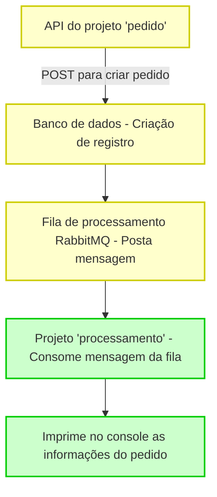

# ms-pedidos-springboot-rabbitmq

Repositório que centraliza microserviços para gerenciamento de pedidos com Spring Boot e RabbitMQ com Cloud AMQP

### Técnologias Exploradas

- Java
- Spring Boot
- Rabbit MQ
- PostgreSQL
- Arquitetura Microserviços
- Cloud AMQP

#### Projeto pedido

Responsável por processar o cadastro de novos pedidos.

Desenvolvido com Java versão 17 e com Maven como gerenciador de dependências.

Versão do Spring Boot = 3.4.4

Dependências:

- Spring Web
- Spring Boot Dev Tools
- Spring Data JPA
- PostgreSQL Driver
- Spring for RabbitMQ

#### Projeto processamento

Reponsável por processar o pedido que foi cadastrado pelo outro microserviço.

Desenvolvido com Java versão 17 e com Maven como gerenciador de dependências.

Versão do Spring Boot = 3.4.4

Dependências:

- Spring Web
- Spring Boot Dev Tools
- Spring Data JPA
- PostgreSQL Driver
- Spring for RabbitMQ

### Fluxo de Interação

API do projeto `pedido` é requisitada, com um POST que cria um registro de pedido no banco de dados e posta uma mensagem na fila de processamento no RabbitMQ.

Na sequência, o projeto `processamento` consome essa mensagem e realiza uma ação. Para fins de teste, apenas imprime no console de saída as informações do pedido recebidas.

